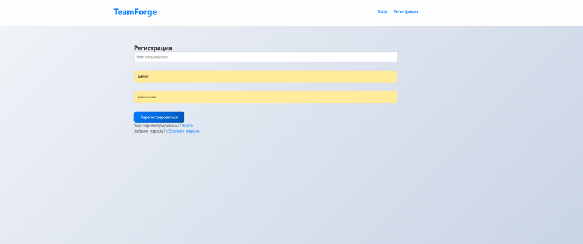
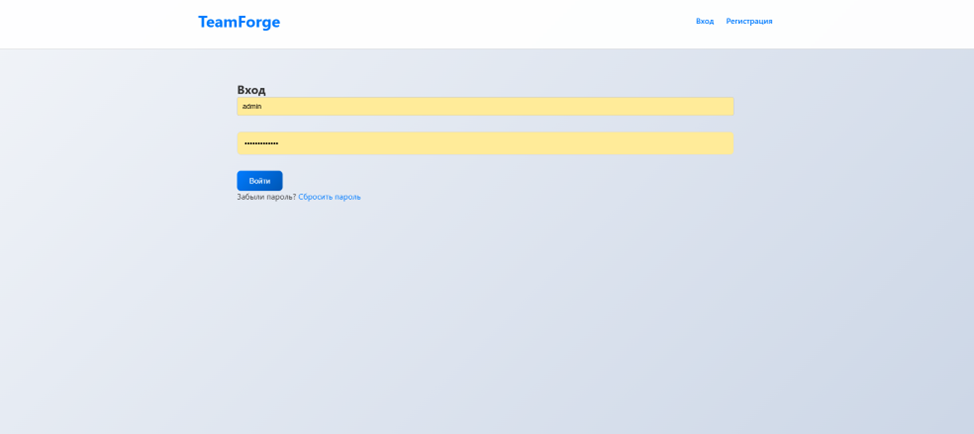
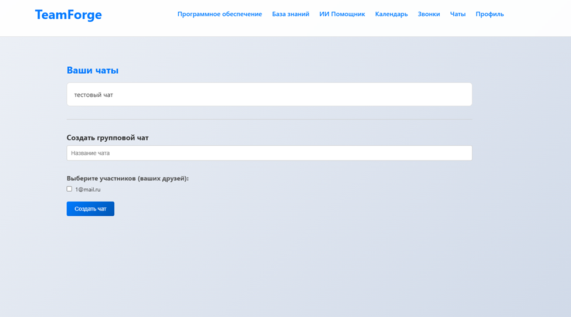
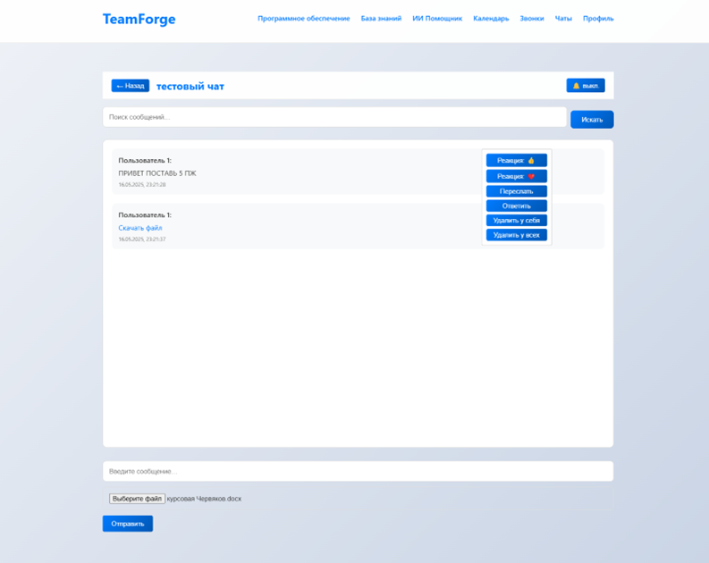
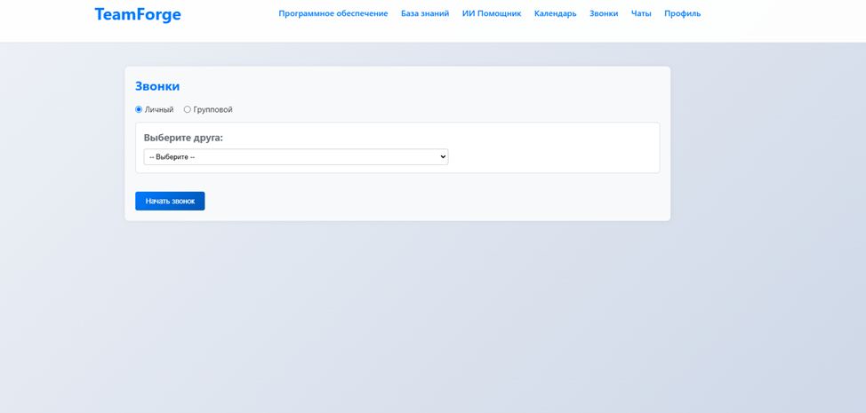
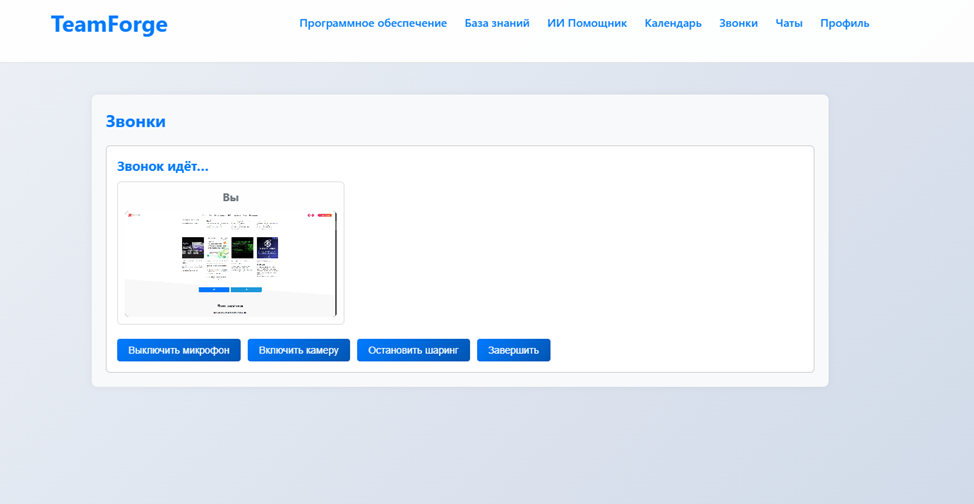
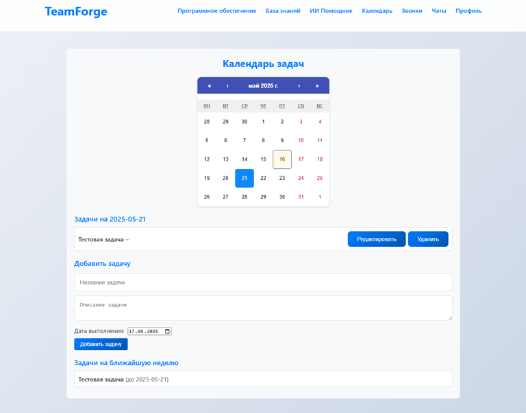
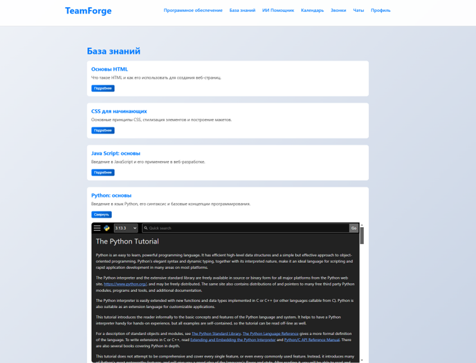
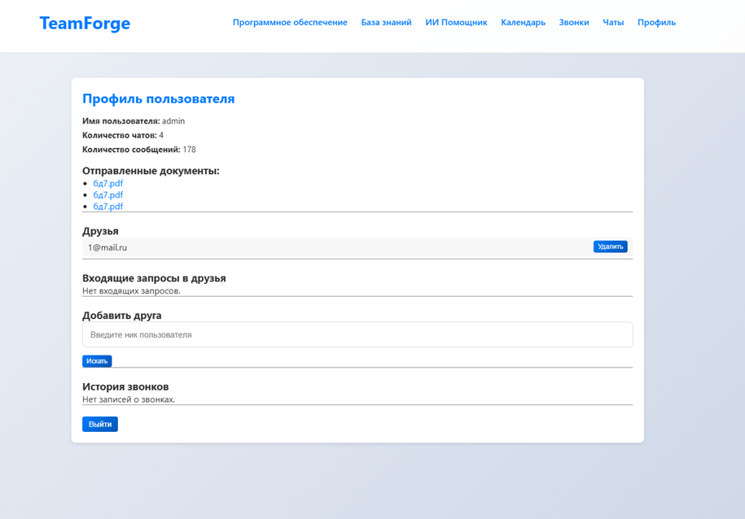

## Инструкция по эксплуатации

Ниже приведена пошаговая инструкция для конечного пользователя. Скриншоты из приложения помогают ориентироваться в интерфейсе.

---

### 1. Запуск и доступ
1. Убедитесь, что сервер запущен (см. раздел **«Введение в эксплуатацию»**).
2. Откройте браузер и перейдите по адресу `https://<your-domain>`.

---

### 2. Регистрация и вход
1. На главной странице кликните **Регистрация**.  
   
2. Заполните поля **Имя пользователя**, **E-mail**, **Пароль** и нажмите **Зарегистрироваться**.
3. Подтвердите адрес электронной почты по ссылке из письма «Welcome to TeamForge».
4. Перейдите на страницу **Вход**, введите e-mail и пароль, нажмите **Войти**.  
   

---

### 3. Работа с чатами
1. Перейдите в раздел **Чаты** в верхнем меню.
2. Список ваших чатов отображается в левой части экрана:  
   
3. **Новый чат**:
   - Личный: нажмите **➕ New Chat**, введите ник коллеги, нажмите **Create**.
   - Групповой: переключитесь на **Group**, задайте название и отметьте участников, нажмите **Create Group**.
4. В окне чата:
   - Укажите текст в поле ввода.
   - Прикрепите файл через кнопку **Выберите файл**.
   - Нажмите **Отправить**.  
     
5. Контекстное меню для каждого сообщения позволяет:
   - Редактировать / Удалить (для себя или всех)
   - Цитировать (Reply)
   - Переслать (Forward)
   - Поставить реакцию (Emoji)

---

### 4. Звонки
1. Откройте раздел **Звонки**.  
   
2. Выберите тип:
   - **Личный звонок**: переключите радио на «Личный», выберите друга из выпадающего списка, нажмите **Начать звонок**.
   - **Групповой звонок**: переключите радио на «Групповой», вставьте ссылку на комнату, нажмите **Начать звонок**.
3. В окне звонка:
   - Разрешите доступ к микрофону и камере.
   - Кнопки управления: **Включить микрофон**, **Включить камеру**, **Остановить шаринг**, **Завершить**.  
     

---

### 5. Управление задачами и календарь
1. Откройте **Календарь** в верхнем меню.  
   
2. **Добавить задачу**:
   - Двойной клик по дате.
   - Заполните **Название**, **Описание**, **Дата выполнения**.
   - Нажмите **Добавить задачу**.
3. **Редактировать / Удалить** задачу — нажмите кнопку рядом с ней.
4. Напоминания: за 24 ч до дедлайна придёт e-mail и toast-уведомление.

---

### 6. База знаний
1. Перейдите в раздел **База знаний**.  
   
2. Слева — структура статей, по центру — содержимое.
3. Поддерживаются Markdown, подсветка кода и встроенные iframe.

---

### 7. Профиль и друзья
1. Откройте **Профиль**.  
   
2. Секция **Друзья**:
   - Поиск пользователя → **Искать** → **Отправить запрос**.
   - Подтвердить / отклонить входящие запросы.
   - Удалить друга — кнопка **Удалить**.
3. История звонков и отправленные файлы отображаются ниже.

---

### 8. Частые вопросы

| Вопрос                                | Ответ                                           |
|---------------------------------------|-------------------------------------------------|
| Как сбросить пароль?                  | На странице входа нажмите **Забыли пароль?**    |
| Как включить тёмную тему?             | Нажмите на логотип **TeamForge** в шапке сайта. |
| Где посмотреть лог звонков?           | **Профиль** → вкладка **Calls**.                |

---

> Все скриншоты оформлены в соответствии с ГОСТ Р ИСО 9241-11 (эргономические требования) и ГОСТ Р ИСО 9241-304 (принципы организации диалога).
